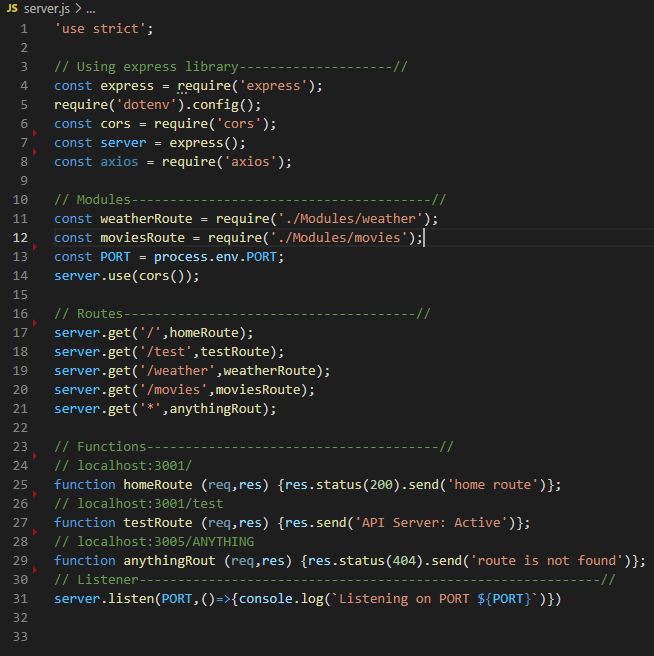
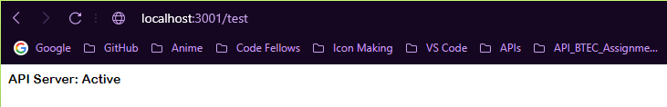

# White Box Testing (Q3.1)

## Back-End Testing

### 1. There should be an active Back-End server to call data from a 3rd party API
|sdf|sdf|
|-----|------|
||*The Back-End server*:|
||This is the back-end server that handels a couple of routes, to check if the server is active go to the route `/test`, and as you can see the back-end server is active.|

<!--  -->

### 2. The server should retrieve data according to the query name from the 'WeatherBit' API when the '/weather' is called and send it as a response, holding the data of the name, latitude and longitude, also the weather forecast of the 6 upcoming days for that query name

### 3. The server should retrieve data according to the query name from the 'TheMOvieDB' API when the '/movies' is called and send it as a response, holding the data of the top movies in the area of the query name

### 4. All calls other than '/weather' and '/movies' should be handled

### 5. All retrieved data should be cached to lower the number of hits on the 3rd party API server

### 6. Retrieved data should have a time stamp of the time that it was retrieved in

## Front-End Testing
