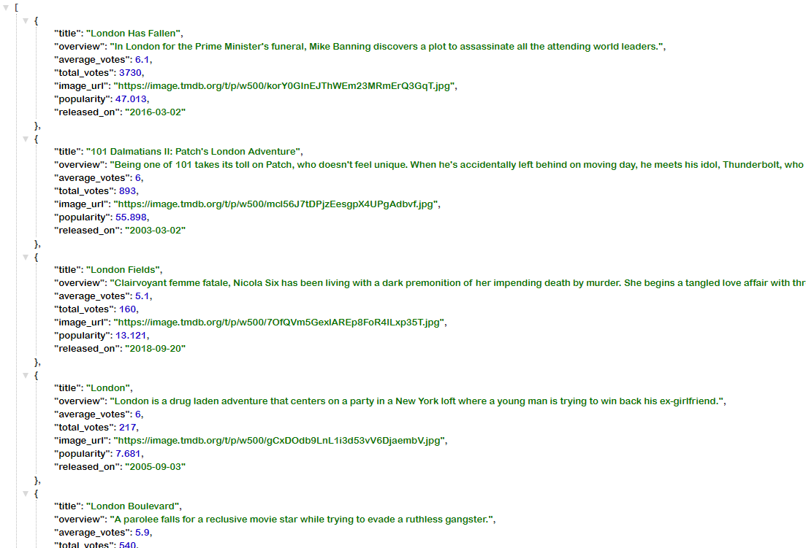
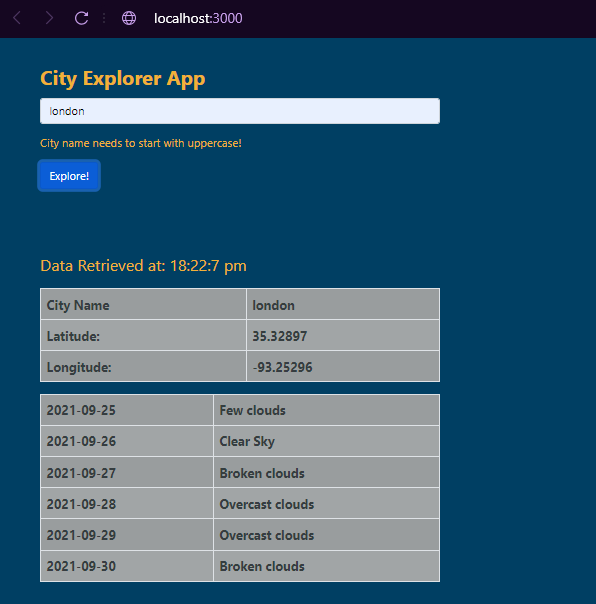

# White Box Testing (Q3.1)

## Back-End Testing

### 1. There should be an active Back-End server to call data from a 3rd party API

|Image|Description|
|-----|------|
||*The Back-End server*|
||*This is the back-end server that handels a couple of routes, to check if the server is active go to the route `/test`, and as you can see the back-end server is active*|

### 2. The server should retrieve data according to the query name from the 'WeatherBit' API when the '/weather' is called and send it as a response, holding the data of the name, latitude and longitude, also the weather forecast of the 6 upcoming days for that query name

|Image|Description|
|-----|------|
||*Weather Module*|
||*Calling the `/weather` (**the server will call the function associated with the call**) **ex**: `server.get('/weather',weatherRoute);`*|
||*Calling the `/weather` and passing it the **query parameter** `city=Seattle`*|
||*The **result** of the call. We got the **name**, **latitude** and **longitude**, also the **weather forecast as a JSON***|

### 3. The server should retrieve data according to the query name from the 'TheMovieDB' API when the '/movies' is called and send it as a response, holding the data of the top movies in the area of the query name

|Image|Description|
|-----|------|
||*Movies Module*|
||*Calling the `/movies` (**the server will call the function associated with the call**) **ex**: `server.get('/movies',moviesRoute);`*|
||*Calling the `/movies` and passing it the **query parameter** `query=london`*|
||*The **result** of the call. We got the **title**, **overview**, **avarage_votes**, **total_votes**, **image_url**, **popularity** and **release date data as a JSON**|

### 4. All calls other than '/weather' and '/movies' should be handled

|Image|Description|
|-----|------|
||*Handling all other routes. **code**: `server.get('*',anythingRout);` (**code at the main server.js**)*|
||*When the route is anything except `/weather` and/or `/movies` the server will return `route is not found` and a `404` **status***|

### 5. All retrieved data should be cached to lower the number of hits on the 3rd party API server

|Image|Description|
|-----|------|
||*Making a `cacheMemory` object in both the `weather module` and the `movies module` to cache all retrieved data form 3rd party API servers*|
||*Here I'm testing if the `cacheMemory` object already contain data that match the passed query parameter, **if yes** it should send it as a respons from the `cacheMemory` object and **log** it to the **console**, but **if it doesn't contain it**, it should **log** `cache memory is empty hit the api` and then respond with data from the **3rd party api server***|
||*console **log** if the data is **not cached***|
||*console **log** if the data **is cached***|

### 6. Retrieved data should have a time stamp of the time that it was retrieved in

|Image|Description|
|-----|------|
||*The code that get the time of retrieving the data*|
||*The server sends the time stamp as a parameter with the data*|

## Front-End Testing

### 1. The front-end should retrieve data from the back-end to render

|Image|Description|
|-----|------|
||*The code that retrieves data from the back-end*|
||*The result of retrieving data from the back-end, with the back-end terminal*|

### 2. If there is an error in retrieving the data from the back-end there should be an alert with the text and the code status of the error

|Image|Description|
|-----|------|
||*An alert example were there is an error in the `URL` when retrieving `weather` data. When there is an error nothing renders but the alert until the error is fixed (status code: 404)*|
||*An alert example were there is an error in the `URL` when retrieving `movies` data. When there is an error nothing renders but the alert until the error is fixed (status code: 200)*|

### 3. All the query data and weather forcast data must be in a table

|Image|Description|
|-----|------|
||*The result of the retrieved data rendered in tables*|

### 4. There should be a map rendered that uses the latitude and longitude data from the beck-end

|Image|Description|
|-----|------|
||*In here the **latitude and longitude** where passed as props from the `app.js` from the **beck-end server** then passed as parameters to the `map URL`*|
||*Here is the result where the **map** is using the **latitude and longitude** data from the **beck-end** and rendering it to the user*|

### 5. The movie data must be rendered to the user, and they should be related to the entered area

|Image|Description|
|-----|------|
||*The user entered `london` as the query parameter, and the app rendered these movies according to the retrieved data from the back-end*|

### 6. If the movie images were null or broken there must be a placeholder

|Image|Description|
|-----|------|
||*The user entered `amman` as the query parameter, and all the broken images where replaced by a broken image placehlder and the title of the movie*|

### 7. The time stamp of retrieving the data should be renderd for the user

|Image|Description|
|-----|------|
||*The data time of retrieval is rendered for the user at `Data Retrieved at: 18:22:7 pm`*|

<!-- |Image|Description|
|-----|------|
|||
||| -->

## References

- My Back-End GitHub Repo Link: [https://github.com/mohammadlebzo/city-explorer-api](https://github.com/mohammadlebzo/city-explorer-api)
- My Front-End GitHub Repo Link: [https://github.com/mohammadlebzo/city-explorer](https://github.com/mohammadlebzo/city-explorer)
